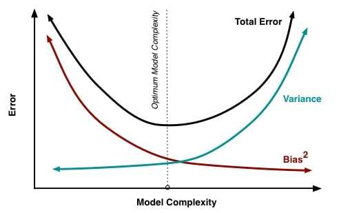

# Questions and Answers

## 1) Explain why you need biases in each hidden layer
Explanation:
1) Inputs come in, are weighed and then summed
2) Sum is activated (maybe by a sigmoid or something...)
3) Changing input weights, changes steepness of (sigmoid) activation function (like so)

4) But what if you want the output to be like 0, when an input is 2 (look at why it can't be the case on image above)
5) Need an ability to translate and offset the activation so that the function can intercept the desired output

6) This is what a bias does, which is a crucial ability for successful machine learning

## Explain when you would use a neural network over logistic regression
Explanation:
1) Logistic regression is like a single layer neural net (it's equation is: sigmoid(sum(W.T*inputs + bias)) which is then thresholded)
2) This means model expressibility is limited to simple classification problems on linearly seperable data classes

3) Remember linear seperability is not just a 2D data thing, but applies to high dimensional data
4) So when dealing with classification problem, try first something simple like logistic regression before NN
5) If unhappy with classification performance (unable to build a high fidelity decision boundary), add layers (build deep NN)
6) Careful how deep you go: logistic regression loss function = convex, but stacking more network layers loses more of the convexity, making it harder to converge on global minimum (harder to train)

## Explain the Bias/Variance Tradeoff
Explanation:
1) Model has bias when not flexible enough to generalize well from data. (Linear parametric algorithms with low complexity like Regression and Naive Bayes have high bias)
2) Model has variance when sensitive and highly flexible to training data. (Non-Linear non-parametric algorithms with high complexity like Decision trees, Neural Network have high variance)

3) Keep tradeoff in mind as high bias and low variance algorithms perform well consistently but typically with lower accuracy
4) Low bias and high variance algorithms have better accuracy but perform inconsistently well
5) Can find balance of bias and variance by regularizing, pruning, etc.

How will you implement dropout during forward and backward pass?
What do you do if Neural network training loss/testing loss stays constant? (ask if there could be an error in your code, going deeper, going simpler…)
Why do RNNs have a tendency to suffer from exploding/vanishing gradient? How to prevent this? (Talk about LSTM cell which helps the gradient from vanishing, but make sure you know why it does so. Talk about gradient clipping, and discuss whether to clip the gradient element wise, or clip the norm of the gradient.)
Do you know GAN, VAE, and memory augmented neural network? Can you talk about it?
Does using full batch means that the convergence is always better given unlimited power? (Beautiful explanation by Alex Seewald: https://www.quora.com/Is-full-batch-gradient-descent-with-unlimited-computer-power-always-better-than-mini-batch-gradient-descent)
What is the problem with sigmoid during backpropagation? (Very small, between 0.25 and zero.)
Given a black box machine learning algorithm that you can’t modify, how could you improve its error? (you can transform the input for example.)
How to find the best hyper parameters? (Random search, grid search, Bayesian search (and what it is?))
What is transfer learning?
Compare and contrast L1-loss vs. L2-loss and L1-regularization vs. L2-regularization.

## Links
- Explain when you would use a neural network over logistic regression: https://www.quora.com/When-should-we-use-logistic-regression-and-Neural-Network
- Explain the bias/variance tradeoff: https://towardsdatascience.com/guide-to-choosing-hyperparameters-for-your-neural-networks-38244e87dafe
