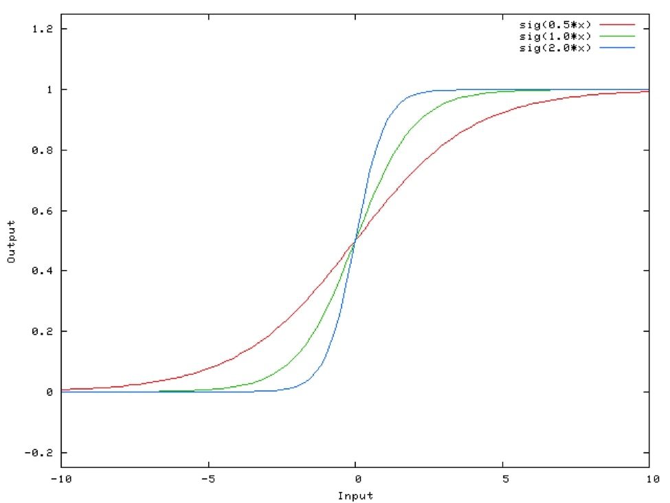
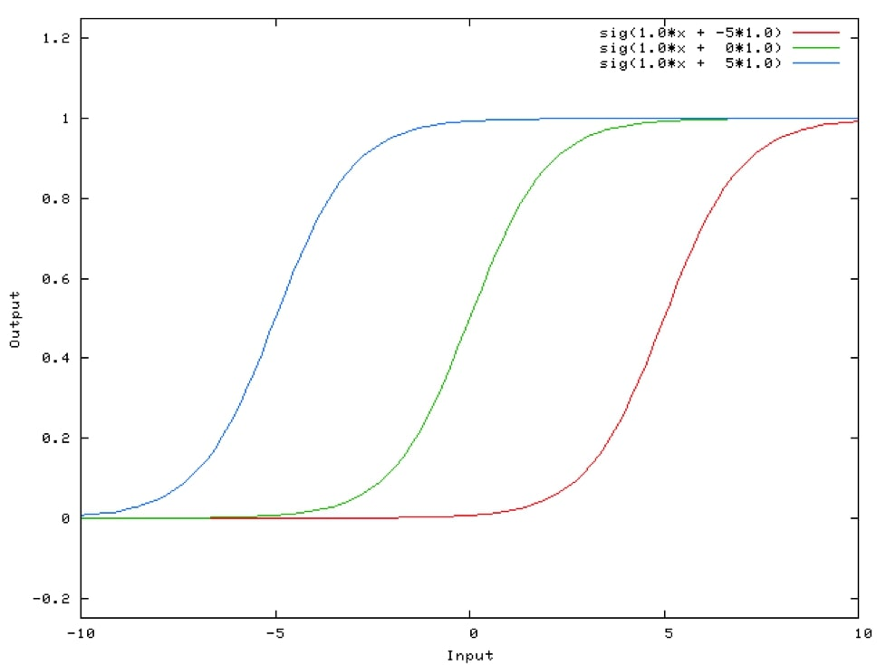
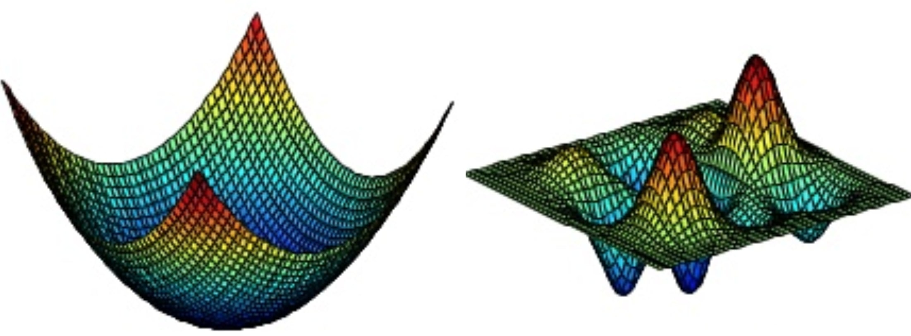

# Questions and Answers

## 1) Explain why you need biases in each hidden layer
Explanation:
1) Inputs come in, are weighed and then summed
2) Sum is activated (maybe by a sigmoid or something...)
3) Changing input weights, changes steepness of (sigmoid) activation function (like so)

4) But what if you want the output to be like 0, when an input is 2 (look at why it can't be the case on image above)
5) Need an ability to translate and offset the activation so that the function can intercept the desired output

6) This is what a bias does, which is a crucial ability for successful machine learning

## Explain when you would use a neural network over logistic regression
Explanation:
1) Logistic regression is like a single layer neural net (it's equation is: sigmoid(sum(W.T*inputs + bias)) which is then thresholded)
2) This means model expressibility is limited to simple classification problems on linearly seperable data classes

3) Remember linear seperability is not just a 2D data thing, but applies to high dimensional data
4) So when dealing with classification problem, try first something simple like logistic regression before NN
5) If unhappy with classification performance (unable to build a high fidelity decision boundary), add layers (build deep NN)
6) Careful how deep you go: logistic regression loss function = convex, but stacking more network layers loses more of the convexity, making it harder to converge on global minimum (harder to train)

## 

