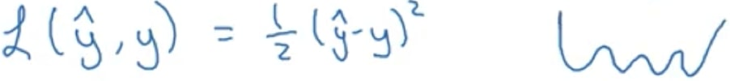
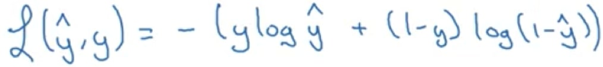
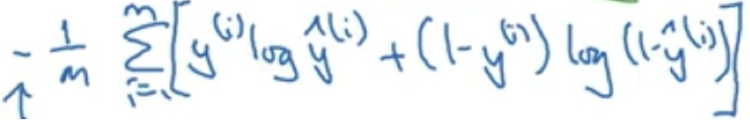

# Basic Networks
## Table of Contents
1. [ NN Basics. ](#NNBasics)
2. [ Shallow NN. ](#shallow)
3. [ Deep NN. ](#deep)
4. [ Hyperparams. ](#Hyperparams)

## 1. Description

##### Logistic regression
Instead of using a for loop to feed images into a neural network. What you do is unrow the red channel of an image, followed by green and blue channels into one giant column like so:

Where the height of the column is equal to the number of pixels in the image, so in this case a 64x64 image will have 3 channels also, which is 64x64x3 = 12,288 so column height is this value.

And then you axially concatenate these vertical feature vectors that represent one image in column form like so to create a big matrix whose height is the image column height, and whose width is the number of images (or number of image columns that you place side by side):

To handle labels you don’t loop over them either but you arrange them in columns just like above:

##### Logistic regression cost function
Choosing your cost function (or your loss/error function) has ramifications on your optimization. Andrew Ng gives example with logistic regression where he says that choosing the square error or ½ square error, can lead to create a loss surface that is none convex, and so when you deploy optimization like SGD you may not find the global minimum because of how non-convex and hilly the loss surface is:

So square error / or ½ square error is typically not combined with logistic regression.

If we used this square error, we want the loss to be small, so that difference will need to be small. In the case of logistic regression you want the loss to also be small, but now because of the shape of the sigmoid you want a loss that can be minimized in 2 separate regions where label is either 1 or 0.

What people like to use instead is a loss function that tries to behave in the following way: if the label is 1, make the estimate large, if the label is 0, make the estimate small. Andrew Ng gives an example of one such a function as:

Where if y = 1:
L(y_hat, y) = -( 1*log(y_hat) + 0*log(1 - y_hat) )
L(y_hat, y) = - log(y_hat)

And if y = 0:
L(y_hat, y) = -( 0*log(y_hat) + 1*log(1 - y_hat) )
L(y_hat, y) = - log(1 - y_hat)

So if we want to minimize loss, we want the expressions - log(y_hat)  and  - log(1 - y_hat) to be small, which means that since they are both negative numbers, they should both be huge, so that we have an immense negative number. This in turn means that y_hat should be huge for y = 1 and tiny for y = 0.

Also the cost-function relates to the entire dataset, whereas the loss function relates to a specific training example. The way that we compute the cost-function is by find the average of the sum of all training examples. So it it:

Where the negative value comes from the fact that there is a negative on the Loss function mentioned earlier up the page.

##### Gradient Descent
##### Derivatives
##### More Derivatives examples
##### Computation graph
##### Derivatives with a Computation Graph
##### Logistic Regression Gradient Descent
##### Gradient Descent on m Examples
##### Vectorization
##### Vectorizing Logistic Regression
##### Notes on Python and NumPy
##### General Notes

## 2. Shallow NN

##### Shallow neural networks
##### Neural Networks Overview
##### Neural Network Representation
##### Computing a Neural Network's Output
##### Vectorizing across multiple examples
##### Activation functions
##### Why do you need non-linear activation functions?
##### Derivatives of activation functions
##### Gradient descent for Neural Networks
##### Random Initialization

## 3. Deep NN

##### Deep Neural Networks
##### Deep L-layer neural network
##### Forward Propagation in a Deep Network
##### Getting your matrix dimensions right
##### Why deep representations?
##### Building blocks of deep neural networks
##### Forward and Backward Propagation
##### Parameters vs Hyperparameters
##### What does this have to do with the brain

## 4. Hyperparams

sometext

