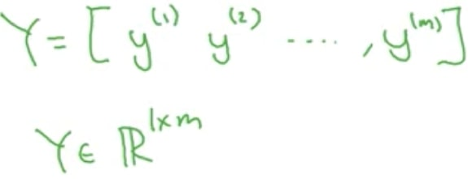

# Basic Networks
## Table of Contents
1. [ NN Basics. ](#NNBasics)
2. [ Shallow NN. ](#shallow)
3. [ Deep NN. ](#deep)
4. [ Hyperparams. ](#Hyperparams)

## 1. Description

##### Logistic regression
Instead of using a for loop to feed images into a neural network. What you do is unrow the red channel of an image, followed by green and blue channels into one giant column like so:

Where the height of the column is equal to the number of pixels in the image, so in this case a 64x64 image will have 3 channels also, which is 64x64x3 = 12,288 so column height is this value.

And then you axially concatenate these vertical feature vectors that represent one image in column form like so to create a big matrix whose height is the image column height, and whose width is the number of images (or number of image columns that you place side by side):

To handle labels you don’t loop over them either but you arrange them in columns just like above:

##### Logistic regression cost function
##### Gradient Descent
##### Derivatives
##### More Derivatives examples
##### Computation graph
##### Derivatives with a Computation Graph
##### Logistic Regression Gradient Descent
##### Gradient Descent on m Examples
##### Vectorization
##### Vectorizing Logistic Regression
##### Notes on Python and NumPy
##### General Notes

## 2. Shallow NN

##### Shallow neural networks
##### Neural Networks Overview
##### Neural Network Representation
##### Computing a Neural Network's Output
##### Vectorizing across multiple examples
##### Activation functions
##### Why do you need non-linear activation functions?
##### Derivatives of activation functions
##### Gradient descent for Neural Networks
##### Random Initialization

## 3. Deep NN

##### Deep Neural Networks
##### Deep L-layer neural network
##### Forward Propagation in a Deep Network
##### Getting your matrix dimensions right
##### Why deep representations?
##### Building blocks of deep neural networks
##### Forward and Backward Propagation
##### Parameters vs Hyperparameters
##### What does this have to do with the brain

## 4. Hyperparams

sometext

